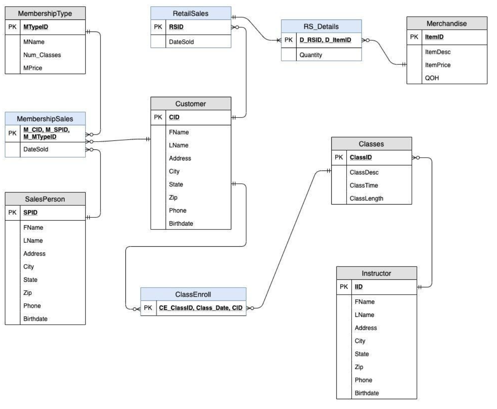
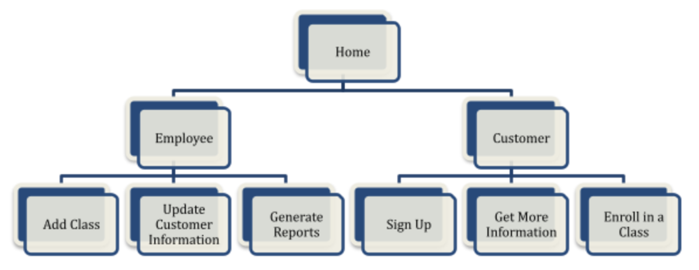
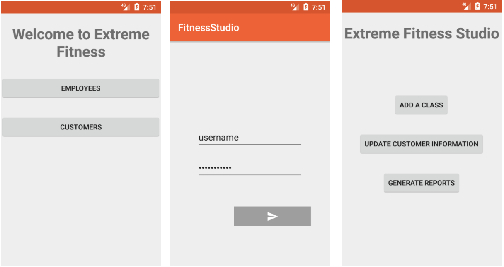
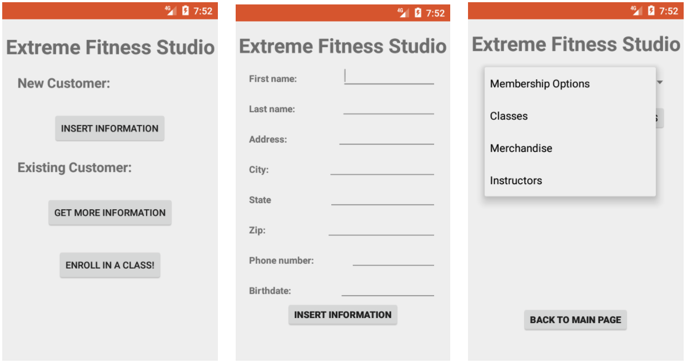

# MIS571 Fitness Studio Database

## Group Members
    Arushi Vyas, Hamidullah Sakhi, Jannik Haas, Raymond Magambo, Ruyun Chen

## Problem Description
Our goal is to design a database for our fitness studio to keep a better overview of our accounts and memberships. The fitness studio offers a variety of daily classes and offers different membership options with varying number of classes that members are allowed to take. The studio also sells retail merchandise such as T-shirts, water bottles, sweatshirts, etc. We will also need to keep track of our employees which include salespeople and instructors. 

### What our database will include and generate reports on: 
- Revenue: The income that our business takes in from normal operations and activities. We will be able to track and compare the different sources of income such as merchandise and memberships. This will also help us be able to understand what items sell the best and be able to focus on advertising these items.
- Class enrollment: Our database will also track class enrollment so we can see which members are signed up for which classes. This will also give us a better understanding of what type of class members enjoy and adjust our schedule to accommodate customers' needs.
- Membership sales: The Fitness studio offers various membership options with varying numbers of classes that customers are allowed to take per month. Tracking how many customers hold each type of membership will give us a better understanding of our customers’ needs. 
- Retail sales: Tracking retails sales allows us to order more merchandise when we are running low as well as seeing what type of items sell best and creating more similar items.
- Employee performance: The database will keep track of the number of memberships sold by each employee which will give the manager concrete statistics to reward outstanding employees and to focus on improving the performance of underperforming employees.

## Conceptual Model 

## Third Normal Form Relations

**Customer (<u>CID</u>**, FName, LName, Birthdate, Address, City, State, Zip, Phone)

**MembershipSales (<u>M_CID, M_SPID, M_MTypeID</u>**, Date_Sold)

**SalesPerson (<u>SPID</u>**, FName, LName, Address, City, State, Zip, Phone, Birthdate)

**MembershipType (<u>MTypeID</u>**, Num_Classes, MPrice, MName)

**RetailSales (<u>RSID</u>**, RS_CID, DateSold)

**RS_Details (<u>D_RSID, D_ItemID</u>**, Quantity)

**Merchandise (<u>ItemID</u>**, ItemDesc, ItemPrice, QOH)

**ClassEnroll (<u>CE_ClassID, Class_Date,CE_CID</u>**)

**Classes (<u>ClassID</u>**, ClassDesc, ClassLength, ClassTime, IID)

**Instructor (<u>IID</u>**, FName, LName, Address, City, State, Zip, Phone, Birthdate)
 
## Entity Relationships 

The relationships captured in our database are as follows: Each customer buys a membership from one salesperson. The relationship is 1:N so that a customer can change their membership later on to a different membership without the database losing information from the first membership sales. Customers can also enroll in many classes and each class can have many customers in it, but customers do not have to be enrolled in classes so that we can store customer information before they have signed up for a class. Similarly, classes do not have to have enrollment so that we can add classes before members sign up for them. Each class is taught by one instructor, and every instructor can teach many classes. On the membership sales aspect of the business, every salesperson can sell many memberships and each type of membership can be sold to many members. Our merchandise is purchased by customers and since customers may buy more than one item at once we have included a detailed table to keep track of the items sold. 

## Android App Navigation 

As shown in the hierarchy chart of the app. The main homepage of the app consists of two buttons: Employee and Customer. Then based on the user selection, it will be directed to either employee or customer subpages. In Employee, the login page will be shown and after user authentication main employee page will appear where the employee can add classes, update customer information, and generate reports. On the other hand, if in the main page user selects the Customer button, it will be directed to the Customer main page where new customer can sign up, if already signed up, he can enroll in classes or get more information about  the Membership  Options, Classes, Merchandise Items, and Instructors. 

App screenshots: 

## Potential Data Quality Problems and How to Reduce Them

Without the use of other advanced or medium levels of relational database management systems, data quality and data insurance is hard to implement. In this project, using the features of relational databases and SQlite, we have implemented constraints and limitations to ensure duplicated data is not entered. Also, using the NOT NULL constraints, we have made sure that all required information is entered while filling out the forms. 

However, there are still some risks identified in this system. Right now, Fitness Studio cannot verify the information that the users provide. Besides, right now the customer can fill as many forms as he wants and this will create data discrepancy and data reliability problem.
